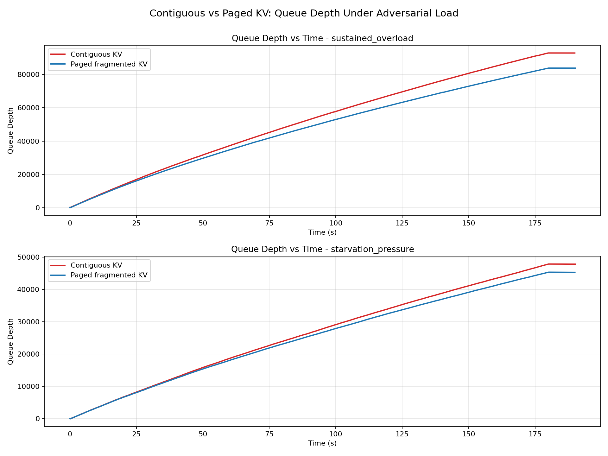
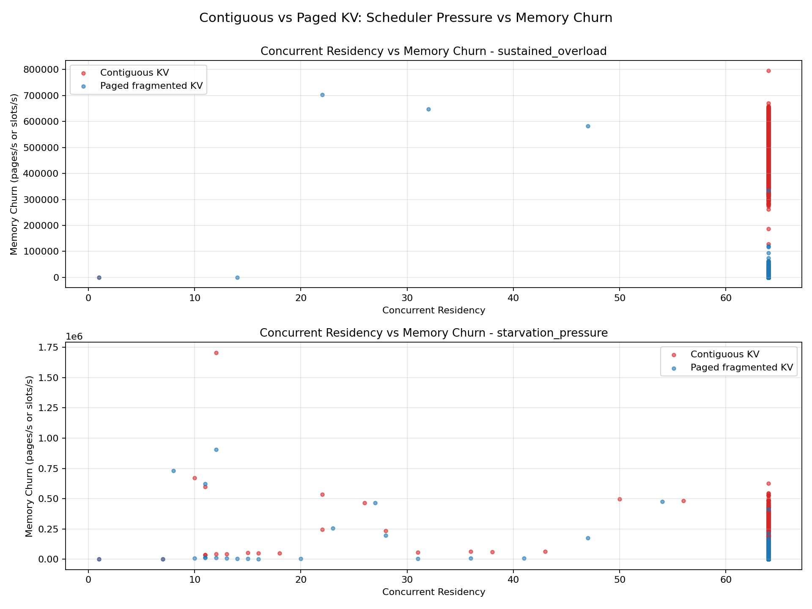

# CacheFlow

CacheFlow is an experimental transformer inference runtime for studying scheduler pressure, KV-cache memory behavior, and allocator stability under sustained serving load. It is intentionally positioned as a runtime systems repository, not as a chatbot, wrapper, fine-tuning project, or general-purpose LLM application.

The codebase evolved from direct autoregressive decoding into a serving-runtime research prototype with explicit memory topology experiments. The current focus is on how continuous batching, scheduler saturation, and paged fragmented KV residency interact under overload.

## What This Project Is For

CacheFlow is built to answer systems questions such as:

- What happens to decode throughput when scheduler pressure rises faster than residency can stabilize?
- How much allocator churn appears when KV residency is contiguous versus paged and fragmented?
- How does the runtime behave when the waiting queue, active batch, and KV footprint all saturate together?
- Which memory topology is more stable under identical workload generation and scheduler policy?
- How do runtime observability signals evolve when the system moves from decode-only inference to sustained overload?

This is a serving-runtime research platform. The point is to observe runtime behavior, not to provide an API wrapper or an application layer.

## Runtime Evolution

CacheFlow developed through a sequence of increasingly realistic runtime behaviors.

### Stage 1: Decoder-Only Inference

The first stage implemented a decoder-only transformer with explicit causal attention and autoregressive generation. The primary goal was to establish a working inference baseline with transparent model execution.

### Stage 2: KV-Cache Incremental Decoding

The second stage separated prefill from decode and introduced KV-cache reuse. This reduced per-token decode complexity and made token-by-token inference more representative of serving workloads.

### Stage 3: Continuous Batching and Scheduler Pressure

The third stage introduced a continuous batching runtime with queue management, admission control, and starvation-aware preemption. At this point the runtime began to behave like a serving system rather than a standalone decoder. Workload generators were added to produce overload conditions and make queue growth, residency pressure, and starvation visible.

### Stage 4: Paged Fragmented KV Residency

The fourth stage introduced paged KV residency with explicit memory topology. `PageAllocator`, `BlockTable`, and logical-to-physical mappings separated ownership from physical placement. This made fragmented KV gathering a runtime behavior instead of a hidden implementation detail and allowed allocator churn to be measured directly.

This evolution is a systems progression, not a feature checklist. Each stage added a different view of runtime pressure.

## Architecture Overview

CacheFlow is organized as a small set of subsystem packages.

- `runtime/` contains the engine, sequence lifecycle, GPT blocks, and the main execution path.
- `scheduler/` owns admission control, batching policy, waiting-queue behavior, and preemption logic.
- `memory/` contains memory backends, page allocation, block tables, and the logical/physical KV abstraction.
- `attention/` contains the attention layer implementation that materializes fragmented KV through the memory backend.
- `tracing/` contains runtime metrics, tracing, and profiler utilities.
- `workloads/` contains synthetic workload generation and pressure profiles.
- `benchmarks/` contains the benchmark scripts used for comparative runtime experiments.
- `plots/` stores generated figures used to interpret runtime behavior.
- `tools/` contains utility scripts such as the weight downloader.

The repository is intentionally compact. It is structured to reflect runtime architecture, not training workflows or application scaffolding.

## Key Runtime Features

CacheFlow currently emphasizes the following runtime behaviors:

- Continuous batching with token-by-token decode orchestration.
- KV-cache reuse across decode steps.
- Memory-aware admission control at the scheduler boundary.
- Starvation-aware preemption for overloaded queues.
- Paged fragmented KV residency with explicit physical page gathering.
- Logical and physical memory separation through `BlockTable` mapping.
- Runtime instrumentation for queue depth, residency, churn, batch size, and gather latency.
- Overload benchmarking under controlled experimental conditions.

These features are intended to expose runtime stability, not to maximize user-facing abstraction.

## Benchmark Methodology

The benchmark comparison in this repository was designed as a controlled systems experiment.

The runtime compared:

- contiguous KV residency
- paged fragmented KV residency

under the same experimental envelope:

- identical scheduler policies
- identical workload generators
- identical residency saturation targets
- identical runtime parameters
- equivalent concurrent residency capacity

The only variable changed between runs was memory topology.

That separation matters. The results are meant to isolate the effect of memory placement and gather behavior, not policy changes or workload drift.

## Benchmark Results

The following measurements come from the controlled comparison runs and should be interpreted as runtime behavior under saturation, not as marketing numbers.

### Sustained Overload

| Memory topology | Throughput | Max queue depth | Allocator churn |
|---|---:|---:|---:|
| Contiguous KV residency | 502 tok/s | 92k | 484k |
| Paged fragmented KV residency | 728 tok/s | 83k | 4.7k |

### Starvation Pressure

| Memory topology | Throughput | Max queue depth | Allocator churn |
|---|---:|---:|---:|
| Contiguous KV residency | 1185 tok/s | 47k | 254k |
| Paged fragmented KV residency | 1412 tok/s | 45k | 6.7k |

### Systems Interpretation

The results show a consistent pattern: contiguous residency amplified allocator instability under sustained saturation, while paged fragmented residency stabilized allocator mutation behavior. Paging also improved overload resilience while preserving equivalent concurrent residency.

The main signal is not just throughput. The important behavior is how allocator churn and queue depth evolve together as the runtime remains under pressure.

## Graphs and Evidence

The benchmark plots are part of the evidence trail for the runtime comparison.

### Queue Depth vs Time



This plot shows overload amplification, queue buildup, and how quickly the scheduler falls behind under each memory topology.

### Residency vs Memory Churn



This plot shows how memory topology influences allocator instability and how churn tracks residency pressure during saturation.

The two plots together reveal topology-induced runtime behavior: queue growth is not only a scheduler phenomenon, and allocator churn is not only a memory detail. Under sustained pressure they are coupled.

## Key Findings

- Paged fragmented residency dramatically reduced allocator churn under sustained overload.
- Fragmented residency stabilized memory behavior during concurrent decode saturation.
- Memory topology strongly influenced runtime stability under scheduler pressure.
- Queue depth, residency pressure, and allocator churn are coupled signals, not independent metrics.


## Repository Layout

- `runtime/` - engine, model blocks, sequence lifecycle, batching utilities
- `scheduler/` - queueing, admission, fairness, and preemption
- `memory/` - KV backends, page allocation, block tables, and mapping logic
- `attention/` - attention traversal and KV materialization
- `tracing/` - runtime metrics, tracers, and profiler helpers
- `workloads/` - synthetic pressure profiles and workload generation
- `benchmarks/` - runtime comparison and stress scripts
- `plots/` - generated figures from benchmark runs
- `reports/` - generated reports and summaries
- `tools/` - operational utilities and helper scripts
- `tests/` - runtime behavior checks

## Environment Setup

Create a virtual environment and install dependencies:

```bash
python3 -m venv .venv
source .venv/bin/activate
pip install -r requirements.txt
```

Download weights if you want to run the example generation entrypoint:

```bash
python tools/weights.py
```

## Running the Runtime

Generate text with the small inference entrypoint:

```bash
python app.py --prompt "The future of AI is"
```

Force CPU or GPU explicitly when needed:

```bash
python app.py --device cpu --prompt "Transformers are"
python app.py --device cuda --prompt "Transformers are"
```

## Benchmarks

Scheduler benchmark:

```bash
python benchmarks/benchmark_scheduler.py --profiles sustained_overload,starvation_pressure --duration-s 300
```

Phase 3 / Phase 4 comparison:

```bash
python benchmarks/compare_contiguous_vs_paged.py --device cuda --dtype float16
```

Memory stress benchmark:

```bash
python benchmarks/stress_memory.py --device cuda --dtype float16 --memory-backend paged
```

## Tests

```bash
python -m pytest -q tests/test_runtime.py
```

## Future Work

The current runtime is intentionally scoped. Reasonable next steps are:

- advanced eviction policies
- smarter scheduler heuristics
- adaptive residency management
- runtime visualization
- distributed runtime simulation

These would extend the research platform without turning it into a different class of project.

## Where to Look First

- `runtime/engine.py` for the execution loop
- `scheduler/scheduler.py` for admission and preemption behavior
- `memory/memory_backend.py` and `memory/page_allocator.py` for residency semantics
- `attention/attention.py` for fragmented KV materialization
- `tracing/tracer.py` for the metrics emitted during runs
- `benchmarks/compare_contiguous_vs_paged.py` for the controlled comparison harness

If a command fails on your machine, the first thing to check is the active Python environment and whether the weights file exists at `weights/gpt2_124m_state_dict.pt`.
